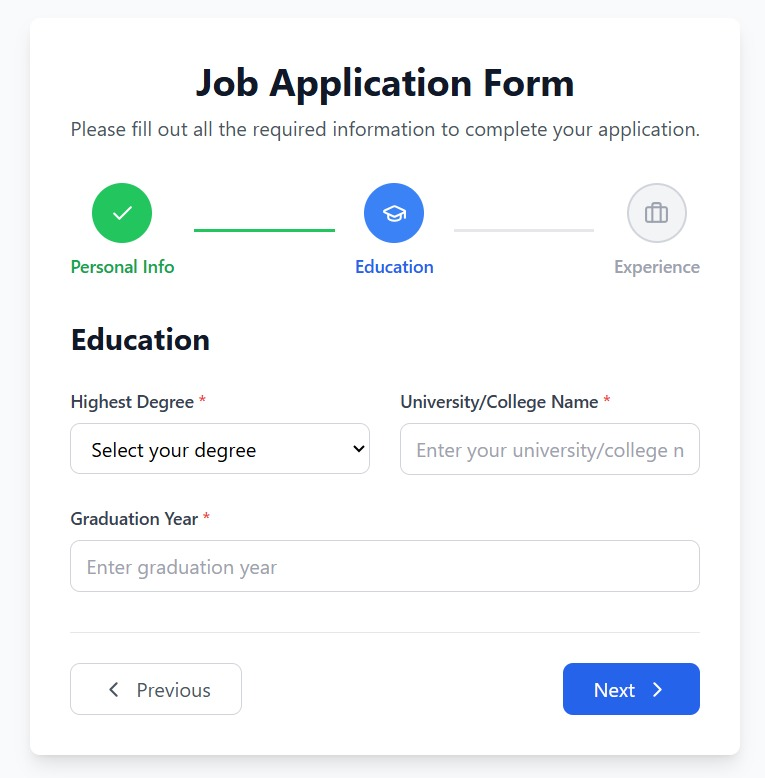
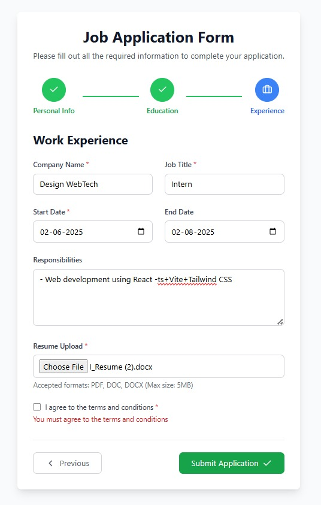
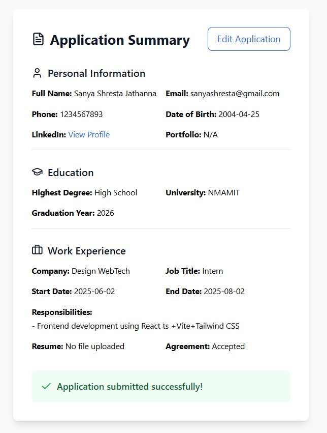

# Job Application Form

A multi-step, modern React job application form with validation, step indicators, and asummary screen.

---

## 🌟 Features

* Multi-step form (Personal Info, Education, Work Experience)
* Validation with custom error messages
* Progress/step indicator
* File upload (resume)
* Data summary and edit/reset functionality
* Modern UI (Tailwind CSS + Lucide icons)

---

## 🖥️ Tech Stack


---

## 🚀 Getting Started

### 1. **Install dependencies**

```bash
npm install
# or
yarn
```

### 2. **Run the dev server**

```bash
npm run dev
# or
yarn dev
```

### 3. **Open in browser**

* Go to [http://localhost:5173](http://localhost:5173) (or the port Vite gives you)

---
### 📸 Example Screenshots

<div style="display: flex; gap: 12px; flex-wrap: wrap;">
  
  
  
  
</div>

---

## 👩‍💻 Author

**Sanya Shresta Jathanna**

[](https://github.com/SanyaShresta25)
[](https://www.linkedin.com/in/sanya-shresta-jathanna)
[](https://sanyashresta.netlify.app/)